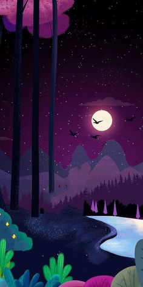

<!DOCTYPE html>
<html lang="es">
  <head>
    <meta charset="UTF-8" />
    <meta http-equiv="X-UA-Compatible" content="IE=edge" />
    <meta name="viewport" content="width=device-width, initial-scale=1.0" />
    <title>Portafolio WEb</title>
    <link rel="stylesheet" href="Estilo.css"/>
    <meta name="viewport" content="width=device-width, initial-scale=1.0">
  </head>
  <body>
    

      <header class="caja2">
        <section class="nombre">
            <h1>Luis Fernando Rengifo Palacios</h1>
        </section>
        <section class="slider">
          <ul>
            <li>
              
            </li>
            <li>
              
            </li>
            <li>
              
            </li>
          </ul>
        </section>
      </header>
      <section class="caja2">
        <article>
          <ul>
            <li>
              
            </li>
            <li>
            
            </li>
            <li>
              
            </li>
            <li>
            
            </li>
          </ul>
        </article>
      </section>
      <section class="caja1">
         <article>
            <ol id="lj1">
                <H2>CONSULTAS</H2> 
                <a href="https://openwebinars.net/blog/que-es-sass-ventajas-desventajas-y-ejemplos-de-desarrollo/">Consulta 1</a> 
                <a href="https://developer.mozilla.org/es/docs/Learn/JavaScript/First_steps/What_is_JavaScript">Consulta 2</a> 
                <a href="https://developer.mozilla.org/es/docs/Web/HTML"> Consulta 3</a> 
                <a href="https://developer.mozilla.org/es/docs/Web/CSS">Consulta 4</a> 
            </ol>
            <ol id="lj2">
                <H2>IMAGENES</H2> 
                <a href="https://fermorecito22.neocities.org/foto.jpg">Imagen 1</a> 
                <a href="https://fermorecito22.neocities.org/githubLogo.jpg">Imagen 2</a> 
                <a href="https://fermorecito22.neocities.org/noon.jpg"> Imagen 3</a> 
                <a href="https://fermorecito22.neocities.org/neocitiesLogo.png">Imagen 4</a> 
            </ol>
            <ol id="lj1">
                <H2>TALLERES</H2> 
                <a href="https://github.com/Fermorecito22/PortafolioWEB">Talleres 1</a> 
                <a href="https://github.com/Fermorecito22/Calculadora-IMC/tree/main">Talleres 2</a> 
                <a href="https://github.com/Fermorecito22/Juego-de-memoria">Talleres 3</a> 
                
            </ol>
            <ol id="lj2">
                <h2>RETOS</h2> 
                <a href="">Retos 1</a> 
                <a href="">Retos 2</a> 
                <a href=""> Retos 3</a> 
                <a href="">Retos 4</a> 
            </ol>
            </article>
        </section>
        <FOOter class="caja2">
            <SECtion>
             
            </SECtion>
            <section>
                
            </section>
        </FOOter>
      
    

  </body>
</html>
